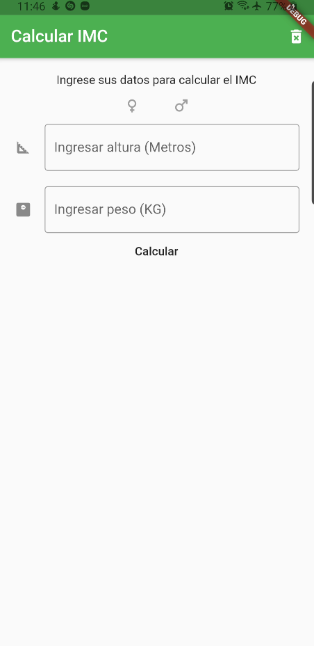
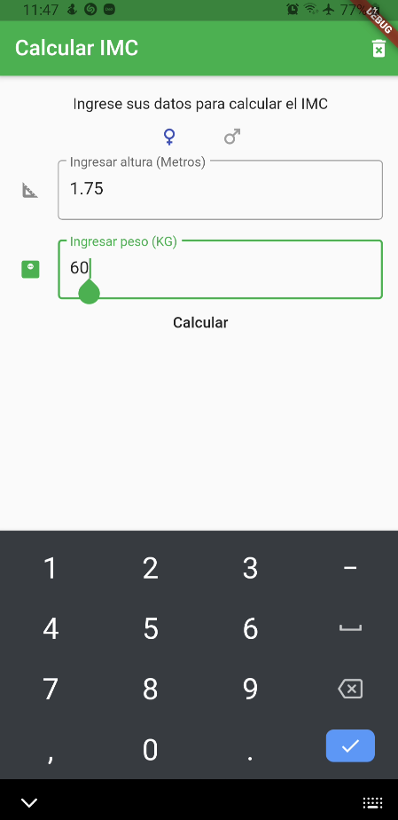
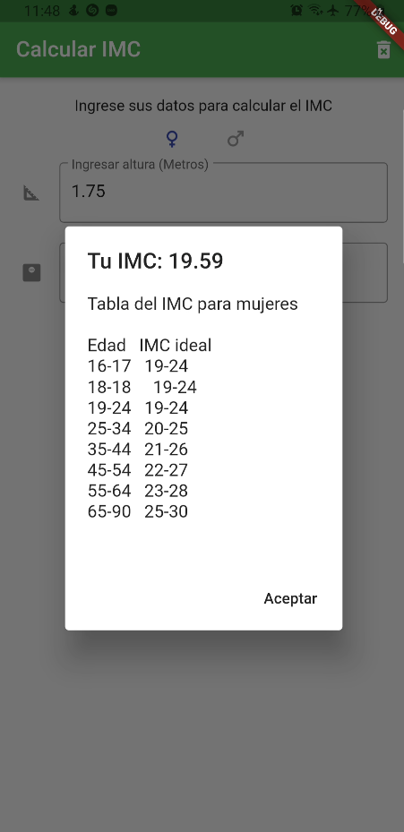

# App 2

App para practicar el disenio de layouts con widgets mas comunes
containers, stacks, row/columns, text fields, etc...
Calcular el IMC y mostrar texto en AlertDialogs

## Getting Started

Recuerda que despues de clonar el proyecto, abrir una terminal dentro de la carpeta del proyecto y ejecutar el comando:

```sh
flutter packages get
``` 

## App Screenshot






